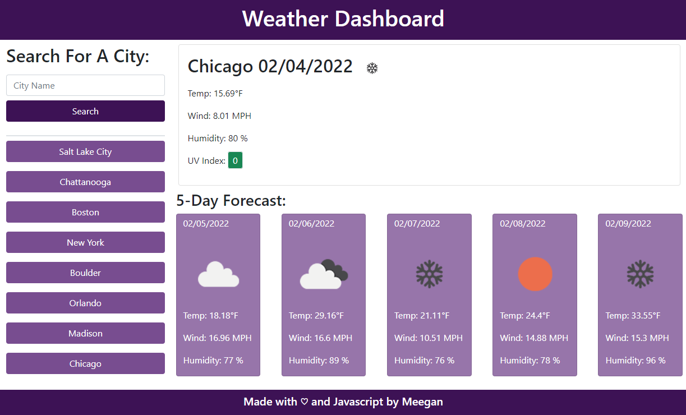

# Weather Dashboard

## Description

- Purpose of this project: To provide current weather and a 5-day forecast for a searched city.
- Problem(s) the app solves: The user not knowing the current or future weather conditions for a city.
- Languages used: HTML, CSS, JavaScript
- Brief description: The user searches for a city and is provided current weather data and a 5-day forecast.

## Table of Contents

- [Installation](#installation)
- [Usage](#usage)
- [License](#license)
- [Contributing](#contributing)
- [Tests](#tests)
- [Questions](#questions)
- [Links](#links)

## Installation

The application runs in the browser, so no installation is required.

## Usage

The user searches via a city name in the input box on the left. After they hit the "Search" button, the current weather data and the 5-day forecast is shown on the right side. A search button in generated for each city searched. If a user clicks on a city in the search history, the weather information for that city is shown,

### Screenshot

## License

This application is licensed under the MIT license.

## Contributing

If you would like to contribute to this application, please follow the Contributor Covenant guidelines.

## Tests

You can test this application by entering unexpected characters into the city input.

## Questions

If you have any questions:

- Email me: [meegan.r.anderson@gmail.com](mailto:meegan.r.anderson@gmail.com)
- Go to my github: [NotANewt](https://github.com/NotANewt)

## Links

- Here is the repo: [NotANewt/Weather Dashboard](https://www.github.com/NotANewt/hw6_weather_dashboard)
- Here is the pages: [NotANewt/pages](https://notanewt.github.io/hw6_weather_dashboard/)
